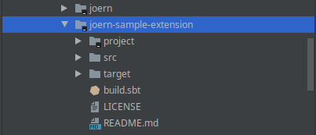
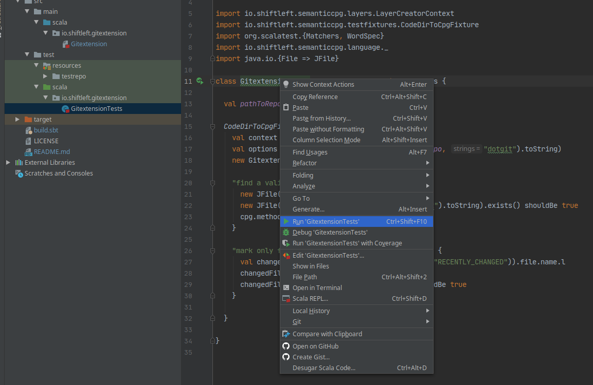

Joern Sample Extension
======================

A sample extension for Joern that determines recently edited files
from a git repository and tags the corresponding file nodes in the
Code Property Graph. Its main purpose it to show how Joern can be used
as a platform for code analysis.

Intro
-----

Joern provides a runtime extension mechanism that allows you to
develop custom analyzers on top of the platform. Extensions are
programs for the JVM that can be written in Java, Scala or
Kotlin. They can access the Code Property Praph via a query language
and create new nodes, edges and properties via the
DiffGraph API. Moreover, they can interface with Java libraries to accomplish
different tasks, like accessing the network or writing to the file system.

The Joern Git Extension is a minimal example of an extension. It reads
a git history using a Java library and tags nodes of files that have
recently been modified. The main purpose of this extension is to
provide an example that shows how Joern extensions can be developed
and tested in the IntelliJ IDE. The extension is written in Scala and
makes use of the Java library jgit.

Dependencies
------------
- the Scala Build Tool (SBT) - any version

Building
--------

```bash
	sbt stage
```

Installation
------------
Check whether the `JOERN_INSTALL` variable is set to your Joern installation directory, then run:

```
./install.sh
```

Running
-------

On the joern shell, type `run`. You should see the extension in the overview:


To run the extension, type `run.gitextension`. You can also
inspect/modify options passed to the plugin by typing
`opts.gitextension.<TAB>`.


Importing into IntelliJ and running tests
-----------------------------------------

Joern Extensions can be developed in an IDE and the process of
importing an extension may differ slightly from IDE to IDE. The
following instructions are for IntelliJ 2020.1.1.

Choose "Open or Import" to import the project.


Next, select the directory from the file selector. Assuming that your
IntelliJ installation has support for `sbt` installed, the import is
fully automated.




Finally, navigate to `src/test/scala/io/shiftleft/gitextension` and
click on `GitextentionTests`. You can right-click on the class or the
individual tests to run them.


